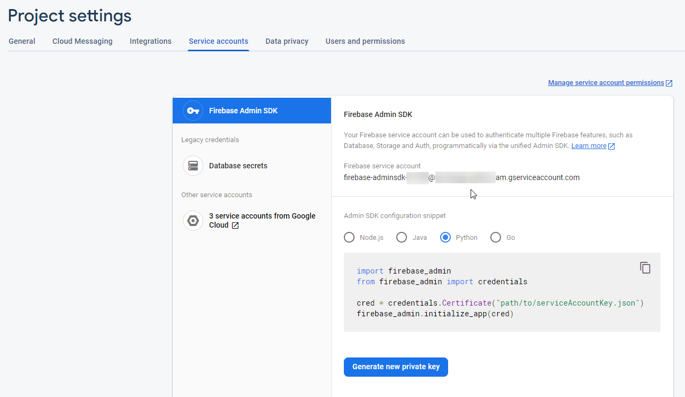

# Description

The purpose of the project is to help quickly filling set of collections to Google Cloud Firestore from other sources.

Was inspired by the task described below.   

## Task description

To execute data transfer from 3 tables of database MS SQl Server into 2 collections Agent and Service into Google Cloud Firestore storage.

It is supposed that the amount of data is big enough, so the time of transfer does matter.

Source data (MS SQL Server):

1. The table Agent - a list of trade agents.
2. The table Service - a list of services provided by agents.
3. The table ServicePrice - a list of service prices.

Result data (Cloud Firestore):

1. The collection Agent - contains documents with agents data.
2. The collection Service - contains documents with services and their prices.

This script could be extended to transfer data from any external source to any collection.

The settings of toml format are used because of supporting multiline string, ex. SQL script.

## How to install

To install the current development version from GitHub, use:

```shell script
pip install git+https://github.com/a-simacov/firestore_filling.git
```

## How to use it in your code

Download the private key file for service account from your Firebase project. How to obtain it see here:

.

Edit the `settings.toml` file with the following: connection settings to MS SQL SERVER, connection settings to Cloud Firestore and rules of transfer data. See example in this repo. 

```python
import firestore_filling

firestore_filling.export_to_firestore('settings.toml')
```

## Plans

To add the validator for settings.toml